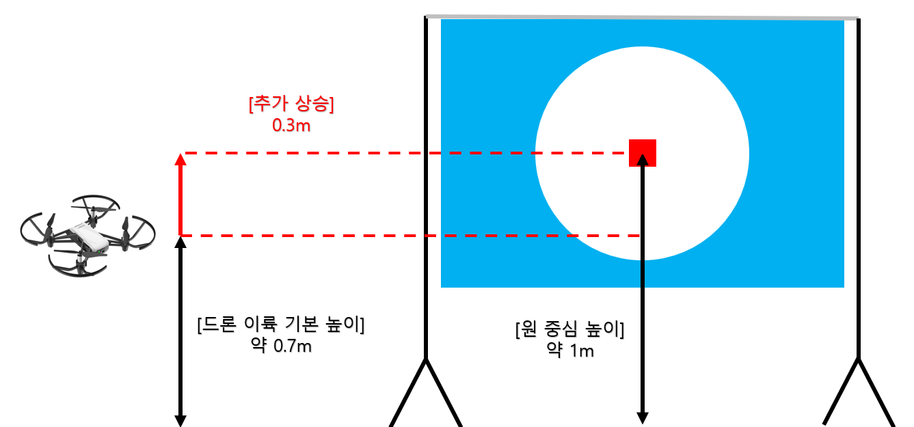
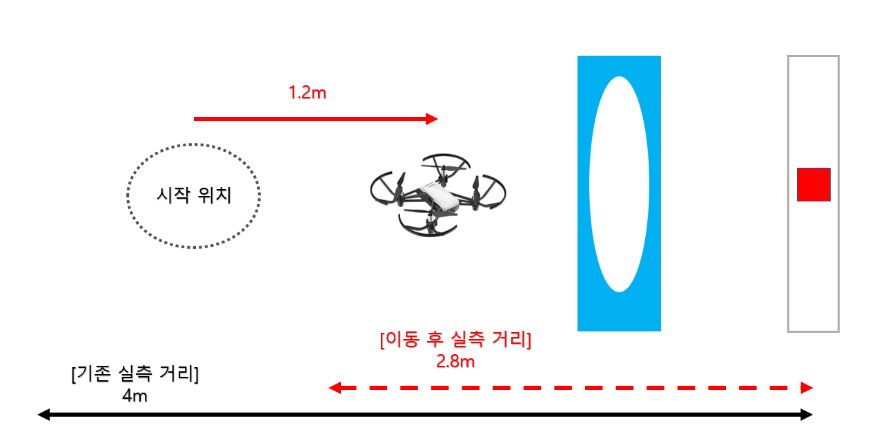
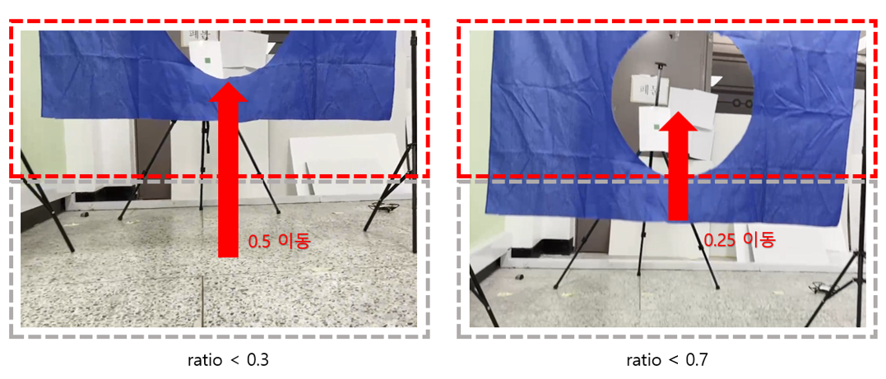

# 0단계

* 코드 실행에 필요한 거리 저장 변수 선언
```
dist_forward = 0.3;       % 대상에 접근하기 위해 전진하는 거리
dist_backward = 0.4;      % 대상을 찾기 위해 후진하는 거리
dist_pass = 1.2;          % 링 통과 후 90도 회전하고 전진하는 거리
Ddist_udlr = 0.2;         % 점 방향으로 이동하기 위한 상하좌우 이동 거리
Rdist_udlr = 0.25;        % 천막 방향으로 이동하기 위한 상하좌우 이동 거리
Rdist_add_forward = 0.5;  % 천막 기준 올바르게 이동한 후 추가적으로 전진하는 거리
height = 1.0;             % 드론의 현재 높이를 저장하는 변수
```

* 드론 객체 선언 → 카메라 객체 선언 → 드론 이륙
```
droneObj = ryze();
cam = camera(droneObj);
takeoff(droneObj);
```

# 1단계
### ● 드론의 높이와 원의 중심을 일치
원의 중심 높이(1m) - 드론 이륙 기본 높이(0.7m) = 추가 상승 (0.3m)
```
moveup(droneObj,'Distance', 0.3,'WaitUntilDone', true);
```
<p align="center"></p>

### ● 실측 거리를 줄임으로써 이동 시간과 오차 감소
```
moveforward(droneObj, 'Distance', 1.5, 'WaitUntilDone', true);
```
<p align="center"></p>

### ● 빨간색 표식을 기준으로 드론의 위치를 제어하는 반복문
> ### 1. 빨간색 표식 픽셀 추출 (RGB)
> ```
> frame = snapshot(cam);
> 
> r = frame(:,:,1);   detect_r = (r > 90) & (r < 200);
> g = frame(:,:,2);   detect_g = (g < 50);
> b = frame(:,:,3);   detect_b = (b < 80);
> 
> detect_Rdot = detect_r & detect_g & detect_b;
> ```
> 
> 
> ### 2. 빨간색 표식의 픽셀 합(red_sum)을 기준으로 드론 이동 제어
> **`[0]`:** 후진 후 다시 빨간색 표식 픽셀 추출 코드로 이동
> 
>  
> 
> ```
> if red_sum == 0
>   moveback(droneObj,'Distance', dist_backward,'WaitUntilDone', true);
>   continue;
> ```
> 
> **`[0~300]`:** 위치 이동 없이 직진
> 
> 
> 
> 
> **`[300~2000]`:** detecting 변수 true로 변경
> 
> 
> 
> ```
> elseif red_sum >= 300
>   detecting = true;
> ```
> 
> **`[2000~3000]`:** 표식의 위치가 중앙에 있지 않다면 detecting 변수 true로 변경
> 
> 
> 
> ```
> elseif red_sum >= 2000
>   r_center = sum(sum(detect_Rdot(fix(end/3):fix(end/3 * 2), fix(end/3):fix(end/3 * 2))));
>   if r_center < 2000
>     detecting = true;
>   end
> ```
> 
> **`[3000~]`:** 90° turn → 1.2m 전진 → 반복문 탈출
> 
> 
> 
> ```
> elseif red_sum >= 3000
>   turn(droneObj, deg2rad(90));
>   moveforward(droneObj, 'Distance', dist_pass, 'WaitUntilDone', true);
>   findRedDot = true;
> ```
> 
>
> ### 3. detecting == true인 경우 드론을 표식 방향으로 이동
> 
> ```
> if (detecting)
>   r_lst = [sum(sum(detect_Rdot(1:fix(end/4*3), 1:end)))   % 상
>            sum(sum(detect_Rdot(fix(end/4):end, 1:end)))   % 하
>            sum(sum(detect_Rdot(1:end, 1:fix(end/3*2))))   % 좌
>            sum(sum(detect_Rdot(1:end, fix(end/3):end)))]; % 우
> ```
> 상하 비율 비교 후 빨간색 픽셀이 더 많은 쪽으로 드론 이동 (좌우 비율 또한 동일한 원리로 작동)
> 
> ```
> if abs(r_lst(1) - r_lst(2)) > 100
>   if r_lst(1) >= r_lst(2) 
>     moveup(droneObj,'Distance', Ddist_udlr,'WaitUntilDone', true);
>   else
>     movedown(droneObj,'Distance', Ddist_udlr,'WaitUntilDone', true);
>   end
> end
> ```
> 
> 
> 
# 2단계
### ● 천막 픽셀의 상하좌우 비율을 기준으로 드론의 위치를 제어하는 반복문
> ### 1. 파란색 천막 픽셀 추출 (RGB)
> ```
> frame = snapshot(cam);
> 
> r = frame(:,:,1);   detect_r = (r < 60);   
> g = frame(:,:,2);   detect_g = (g > 10) & (g < 120);
> b = frame(:,:,3);   detect_b = (b > 50) & (b < 190);
> 
> detect_Brect = detect_r & detect_g & detect_b;  
> ```
> 
> 
> ### 2. 파란색 천막 픽셀의 합이 100 이하라면 좌우 탐색 후 위치 이동
> 
> 
> **[1]** 정면 기준 -45° turn → sum1 값 저장
> ```
> turn(droneObj, deg2rad(-45));
> frame = snapshot(cam);
> r = frame(:,:,1);   detect_r = (r < 60);   
> g = frame(:,:,2);   detect_g = (g > 10) & (g < 120);
> b = frame(:,:,3);   detect_b = (b > 50) & (b < 190);
> detect_Brect = detect_r & detect_g & detect_b;
> sum1 = sum(sum(detect_Brect));
> ```
> **[2]** 정면 기준 +45° turn → sum2 값 저장
> ```
> turn(droneObj, deg2rad(90));
> frame = snapshot(cam);
> r = frame(:,:,1);   detect_r = (r < 60);   
> g = frame(:,:,2);   detect_g = (g > 10) & (g < 120);
> b = frame(:,:,3);   detect_b = (b > 50) & (b < 190);
> detect_Brect = detect_r & detect_g & detect_b;
> sum2 = sum(sum(detect_Brect));
> ```
> **[3]** sum값이 더 큰 곳으로 0.5m 이동 후 파란색 천막 픽셀 추출 코드로 이동
> ```
> turn(droneObj, deg2rad(-45));
> if sum1 >= sum2
>   moveleft(droneObj, 'Distance', 0.5, 'WaitUntilDone', true);
> else
>   moveright(droneObj, 'Distance', 0.5, 'WaitUntilDone', true);
> end
> continue;
> ```
> ### 3. 파란색 픽셀의 상하좌우 비율 계산
> 
> 
> ```
> B_lst = [sum(sum(detect_Brect(1:fix(end/2), 1:end))) 
>          sum(sum(detect_Brect(fix(end/2):end, 1:end)))
>          sum(sum(detect_Brect(1:end, 1:fix(end/2))))  
>          sum(sum(detect_Brect(1:end, fix(end/2):end)))];
>          
> ratio1 = min(B_lst(1), B_lst(2)) / max(B_lst(1), B_lst(2));
> ratio2 = min(B_lst(3), B_lst(4)) / max(B_lst(3), B_lst(4));
> ```
> 
> ### 4. 계산한 비율을 중심으로 드론 이동 제어
> **[올바른 비율 탐색 성공]:** 0.4m 하강 → 0.5m 전진 → 반복문 탈출
> ```
> if((ratio1 >= 0.7) && (ratio2 >= 0.7))
>   movedown(droneObj, 'Distance', 0.4, 'WaitUntilDone', true);
>   height = height - 0.4
>   moveforward(droneObj, 'Distance', 0.5, 'WaitUntilDone', true);
>   findRightPos = true;
> ```
> > **[올바른 비율 탐색 실패]**
> > 
> > i) 현재 파란색 천막에 매우 근접한 상황이라면 후진한 후 위의 과정 반복
> > 
> > 
> > 
> > ```
> > b_center = sum(sum(detect_Brect(fix(end/3):fix(end/3 * 2), fix(end/3):fix(end/3 * 2))));
> > if b_center >= 70000
> >   moveback(droneObj,'Distance', dist_backward,'WaitUntilDone', true);
> > ```
> > 
> > ii) 그렇지 않은 경우 파란색 픽셀이 많은 쪽으로 상하/좌우 이동
> > 
> > 
> > 
> > ```
> > if ratio1 < 0.7
> >   if B_lst(1) >= B_lst(2) 
> >     moveup(droneObj,'Distance', Rdist_udlr,'WaitUntilDone', true);
> >     height = height + Rdist_udlr;
> >   else
> >     movedown(droneObj,'Distance', Rdist_udlr,'WaitUntilDone', true);
> >     height = height - Rdist_udlr;
> >   end
> > end
> >  
> > if ratio2 < 0.7
> >   if B_lst(3) >= B_lst(4)
> >     moveleft(droneObj,'Distance', Rdist_udlr,'WaitUntilDone', true);
> >   else
> >     moveright(droneObj,'Distance', Rdist_udlr,'WaitUntilDone', true);
> >   end
> > end
> > ```
### ● 초록색 표식을 기준으로 드론의 위치를 제어하는 반복문
> ### 1. 초록색 표식 픽셀 추출 (HSV)
> ```
> frame = snapshot(cam);
> frame = rgb2hsv(frame);
> 
> h = frame(:,:,1); detect_h = (h >= 0.2) & (h <=0.42);
> s = frame(:,:,2); detect_s = (s >= 0.1) & (s <= 0.6);
> 
> detect_Gdot = detect_h & detect_s;
>
> canny_img = edge(detect_Gdot, 'Canny', 0.9, 9);
> 
> fill_img = imfill(canny_img, 'holes');
> ```
> 
> 
> ### 2. 초록색 표식의 픽셀 합(green_sum)을 기준으로 드론 이동 제어
> **`[0]`:** 후진 후 다시 초록색 표식 픽셀 추출 코드로 이동
> ```
> if green_sum == 0
>     moveback(droneObj,'Distance', dist_backward,'WaitUntilDone', true);
>     continue;
> ```
> **`[300~2000]`:** detecting 변수 true로 변경
> ```
> elseif green_sum >= 300
>     detecting = true;
>```
> **`[2000~]`:** 90° turn → 1.2m 전진 → 반복문 탈출
> ```
> elseif green_sum >= 2000
>     turn(droneObj, deg2rad(90));
>     moveforward(droneObj, 'Distance', dist_pass, 'WaitUntilDone', true);
>     findGreenDot = true;
> ```
> ### 3. detecting == true인 경우 드론을 표식 방향으로 이동
> ```
> if (detecting)
>     g_lst = [sum(sum(fill_img(1:fix(end/4*3), 1:end)))
>             sum(sum(fill_img(fix(end/4):end, 1:end)))
>             sum(sum(fill_img(1:end, 1:fix(end/4*3))))
>             sum(sum(fill_img(1:end, fix(end/4):end)))];
> ``` 
> 1단계와 동일하게 상하/좌우 비율 비교 후 초록색 픽셀이 더 많은 쪽으로 드론 이동
> 
# 3단계
### ● 드론의 높낮이 조절
천막이 안보이는 경우를 대비해, 드론의 현재 높이(height)가 0.75보다 낮을 경우 위로 이동
```
if height <= 0.75
    moveup(droneObj,'Distance', 0.7,'WaitUntilDone', true);
end
```


### ● 최적 각도 탐색
천막을 탐색하기 위해, 2단계 통과 후 90° 회전한 상태에서 10°씩 총 80°를 회전해본다.

파란색 천막의 픽셀을 가장 많이 검출한 각도가 최적의 각도가 된다.
```
% 10도씩 회전하며 탐색
max_sum = 0;
for index=1:8   
    if index > 1
        turn(droneObj, deg2rad(10));
    end

    frame = snapshot(cam);
    r = frame(:,:,1);   detect_r = (r < 60);   
    g = frame(:,:,2);   detect_g = (g > 10) & (g < 120);
    b = frame(:,:,3);   detect_b = (b > 50) & (b < 190);
    detect_Brect = detect_r & detect_g & detect_b;
    sum_blue = sum(sum(detect_Brect));

    if sum_blue > max_sum
        max_sum = sum_blue;
        max_index = index;
    end
end
```
```
% 최적 각도
turn_radi = (-1) * 10 * (8 - max_index);    
turn(droneObj, deg2rad(turn_radi));
moveforward(droneObj, 'Distance', 0.7, 'WaitUntilDone', true);
```


### ● 천막 및 표식 탐색 코드는 2단계와 동일
보라색 표식에서 착지
